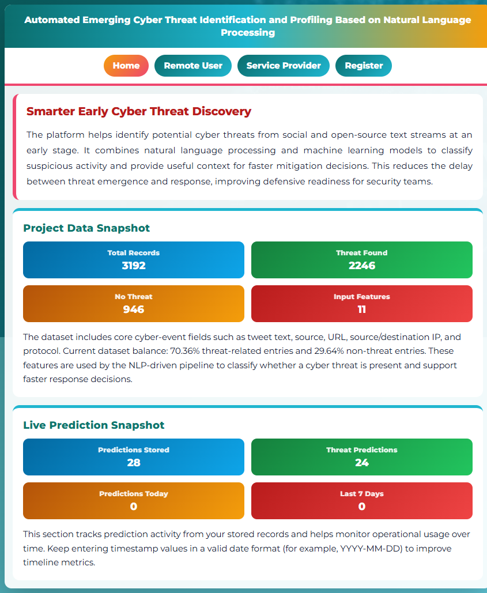
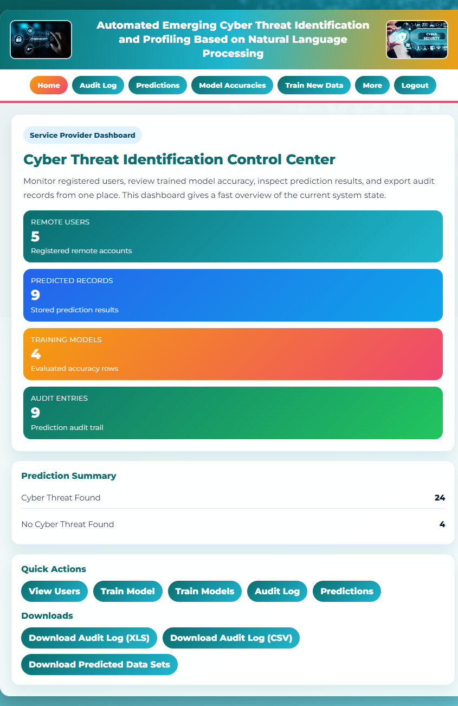
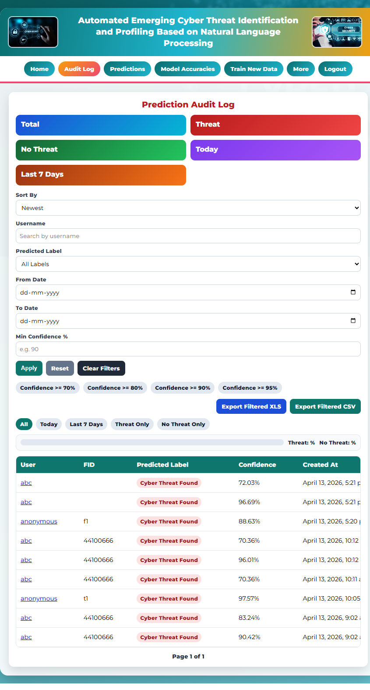
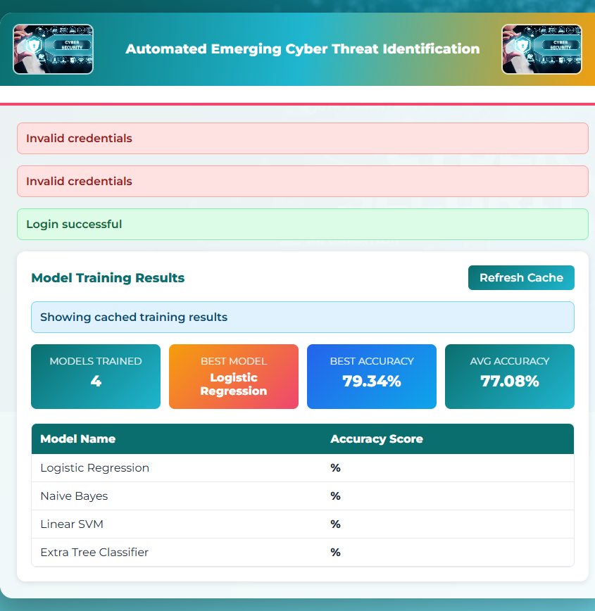
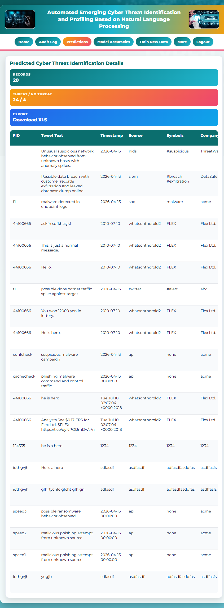
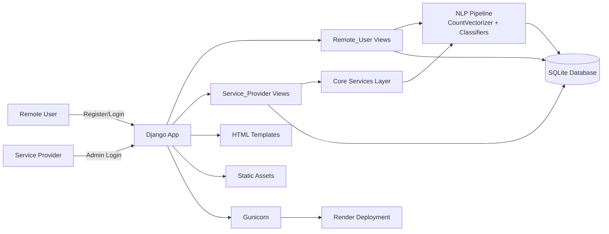
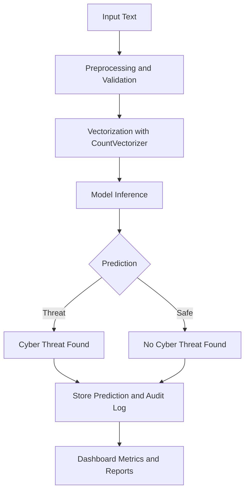

# Automated Emerging Cyber Threat Identification

## Overview
This is a Django-based NLP project that detects whether a social media or news-like text input indicates a cyber threat. It includes a remote user portal for prediction and a service provider dashboard for model training, analytics, and audit review.

## Problem Statement
Security teams need a fast way to identify threat-related text in large streams of posts, messages, or reports. Manual review is slow, inconsistent, and does not scale.

## Solution
The application converts text into numerical features, trains multiple machine learning models, and classifies incoming text as either `Cyber Threat Found` or `No Cyber Threat Found`. The service provider dashboard also tracks model accuracy, prediction history, and audit logs.

## Features
- User registration, login, profile view, and threat prediction
- Service provider dashboard with analytics and audit logs
- Training pipeline for uploaded CSV files
- Model comparison and accuracy charts
- Export/download support for prediction records
- Render deployment support with static files and Gunicorn

## Tech Stack
- Backend: Django 5.2.3, Python 3.10
- ML/NLP: pandas, NumPy, scikit-learn, joblib
- Vectorization: CountVectorizer
- Models: Multinomial Naive Bayes, Linear SVM, Logistic Regression, Extra Tree Classifier
- Deployment: Render, Gunicorn, WhiteNoise
- Database: SQLite

## Project Structure
- `apps/Remote_User/` - user-facing views, models, registration, prediction logic
- `apps/Service_Provider/` - admin/service provider views, analytics, training, downloads
- `apps/core/` - shared Python services and utilities
- `templates/RUser/` - user templates
- `templates/SProvider/` - service provider templates
- `templates/base.html` - shared base layout
- `templates/analytics_chart.html` - consolidated analytics page
- `templates/model_training.html` - consolidated training page
- `docs/screenshots/` - captured web page screenshots used in this README
- `data/Datasets.csv` - bundled training dataset
- `static/` - images and static assets

## Screenshots

### Home Page


### Remote User Login


### Service Provider Login


### Registration Page


### Service Provider Dashboard


### Audit Log


### Model Accuracy Dashboard


### Predictions Table


## Architecture Diagram


## Pipeline Workflow


## Dataset Details
- Source: bundled project CSV file (`data/Datasets.csv`)
- Size: 3,280 rows
- Type: structured text dataset
- Key columns: `fid`, `tweet_text`, `timestamp`, `source`, `symbols`, `company_names`, `url`, `source_ip`, `protocol`, `dest_ip`, `Label`

## Data Preprocessing
- Text is converted to numeric features with `CountVectorizer`
- Labels are normalized into threat / no-threat classes
- Timestamp values are parsed for prediction history and dashboard metrics
- Training CSV uploads are validated to ensure required columns exist

## Feature Engineering
- Bag-of-words representation using `CountVectorizer`
- Classification-ready feature matrices built from `tweet_text`

## Model Details
Algorithms used:
- Multinomial Naive Bayes
- Linear SVM
- Logistic Regression
- Extra Tree Classifier

Why these models:
- They are strong baseline classifiers for text classification
- They provide a good comparison of speed, interpretability, and accuracy

## Training Process
- Dataset is split into train and test sets
- Multiple classifiers are trained on the same feature set
- Results are stored in the database for dashboard display
- Prediction cache is refreshed when the service provider requests it

## Evaluation Metrics
- Accuracy
- Model comparison on the dashboard
- Prediction counts and audit statistics

## Current Results
Current saved model scores in the application database:

| Model | Accuracy |
| --- | --- |
| Naive Bayes | 77.00% |
| Linear SVM | 76.84% |
| Logistic Regression | 79.34% |
| Extra Tree Classifier | 75.12% |

Prediction summary currently stored:
- Total predictions: 28
- Cyber Threat Found: 24
- No Cyber Threat Found: 4

## Insights
- Logistic Regression is currently the best saved model in the project database.
- The dataset is moderately imbalanced toward threat-labeled examples.
- CountVectorizer provides a simple and effective baseline for this text classification task.

## Limitations
- The project uses a single bundled CSV dataset, so model quality depends on that data.
- CountVectorizer does not capture semantic context like modern embeddings.
- SQLite is suitable for development and small deployments, but not ideal for large-scale production use.

## Deployment
- Platform: Render
- Build command: `pip install -r requirements.txt`
- Start command: `gunicorn config.wsgi:application`
- Static files are served with WhiteNoise

## Installation
1. Create a virtual environment.
2. Install dependencies:
   ```bash
   pip install -r requirements.txt
   ```
3. Run migrations:
   ```bash
   python manage.py migrate
   ```
4. Collect static files if needed:
   ```bash
   python manage.py collectstatic --noinput
   ```

## How to Run
```bash
python manage.py runserver
```

Open the app in your browser, then use:
- Remote user login / registration for predictions
- Service provider login for analytics and training

## Testing
```bash
python manage.py check
python manage.py migrate
```

## Security and Ethics
- User input should be validated before prediction.
- Prediction outputs should be treated as decision support, not final security verdicts.
- Real-world deployments should review privacy, bias, and access-control concerns.

## Future Improvements
- Replace CountVectorizer with embeddings or TF-IDF comparisons
- Add precision, recall, F1-score, and confusion matrix reporting
- Move from SQLite to PostgreSQL for production-scale usage
- Add automated tests for model and view behavior

## License
No explicit license file is included in the repository.
